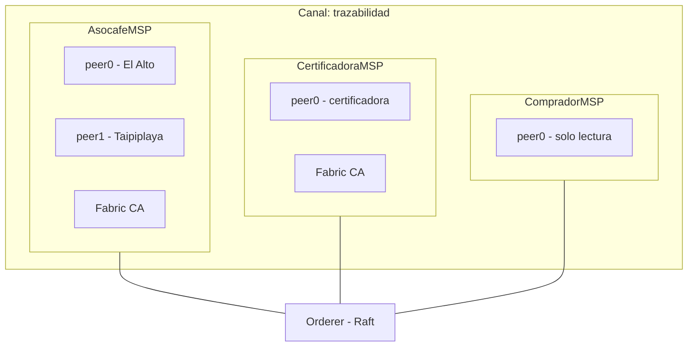
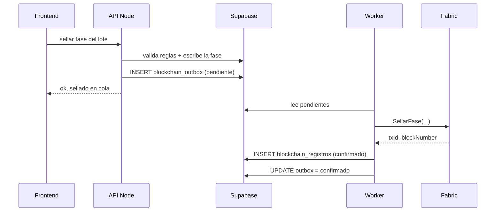

# Modelo de blockchain - Hyperledger Fabric

Propuesta para CoffeeTrace / ASOCAFE Taipiplaya, alineada con el esquema ya
cargado en Supabase (25 tablas, 1.352 entregas, 9 lotes).

---

## 1. Que va en la cadena y que no

La decision mas importante del diseno: **Supabase sigue siendo el sistema de
registro. Fabric solo notariza.**

| | Supabase | Fabric |
|---|---|---|
| Detalle de entregas, personas, pagos | si | no |
| Consultas, reportes, UI | si | no |
| Hash de cada fase sellada | si (copia) | si (autoridad) |
| Pesos que el comprador verifica | si | si |
| Nombres de productores | si | no |
| Precios y montos pagados | si | no |

Tres razones para no volcar todo a la cadena:

**Privacidad.** Los compradores estan en Alemania (Ann Katterine) y Corea
(ANDES COFFEE). El RGPD europeo reconoce el derecho de supresion, y un
ledger inmutable con nombres y cedulas de 102 personas entra en conflicto
directo con eso. Los datos personales se quedan fuera de la cadena o van en
colecciones privadas.

**Confidencialidad comercial.** Lo que se le paga a cada socio (1.717.494,69 Bs
en la campania 2025) y el precio de cada contrato no son datos que un comprador
deba ver del otro.

**Practicidad.** El world state de Fabric no es una base de datos de consultas.
Filtrar 1.352 entregas por fecha y comunidad se hace en Postgres, no en
chaincode.

---

## 2. Red



### Organizaciones

| Org | Rol | Peers |
|---|---|---|
| `AsocafeMSP` | Escribe todas las fases | El Alto + Taipiplaya |
| `CertificadoraMSP` | **Co-firma lo que afecta a la certificacion** | 1 |
| `CompradorMSP` | Solo lectura y verificacion | 1 (opcional) |

**La organizacion de la certificadora no es opcional: es donde esta todo el
valor.** Una red Fabric donde ASOCAFE es la unica organizacion que endosa no
prueba nada que una base de datos firmada no pruebe mas barato. El sello sirve
porque un tercero independiente lo co-firma.

Si la certificadora no puede operar un peer, la alternativa honesta es que lo
haga un actor con interes contrario al de ASOCAFE: el comprador, o una
institucion del sector. Pero alguien distinto de ASOCAFE tiene que endosar.

### Canales y colecciones privadas

Un solo canal `trazabilidad`, con dos colecciones privadas:

| Coleccion | Contenido | Quien lo ve |
|---|---|---|
| `datosProductores` | Nombres, parcelas, kg por socio | Asocafe + Certificadora |
| `datosComerciales` | Precios, contratos, montos | Asocafe + el comprador de ese lote |

Las private data collections guardan el dato real solo en los peers
autorizados; en el ledger comun queda unicamente su hash. Sirve para el caso
"el comprador quiere auditar que el lote viene de socios certificados" sin
publicar el padron entero.

---

## 3. Modelo de datos on-chain

Tres tipos de activo. Todo en TypeScript porque el equipo ya es Node.

```typescript
type Fase =
  | 'acopio' | 'transporte' | 'recepcion' | 'limpieza' | 'trillado'
  | 'seleccion' | 'almacenamiento' | 'despacho' | 'exportacion'

/** Clave: lote~{codigo}   ej. lote~OR-01-25 */
interface Lote {
  docType: 'lote'
  codigo: string                     // OR-01-25
  campania: number                   // 2025
  certificacion: 'organico' | 'transicion'
  faseActual: Fase
  secuencia: number                  // cuantas fases lleva selladas
  hashCabeza: string                 // ultimo hash de la cadena
  kgGuindaAcopiada: number
  kgPergaminoDespachado?: number
  kgVerdeExportado?: number
  kgEnMuestras: number
  productores: number                // agregado, SIN nombres
  comunidades: number                // agregado
  creadoEn: string                   // txTimestamp, nunca Date.now()
}

/** Clave: fase~{codigoLote}~{secuencia padded}   ej. fase~OR-01-25~0003 */
interface FaseSellada {
  docType: 'fase'
  lote: string
  secuencia: number
  fase: Fase
  hashPayload: string                // SHA-256 del payload canonico
  hashAnterior: string               // encadena con la fase previa
  refSupabase: string                // "envios:uuid" para recuperar el detalle
  pesos: Record<string, number>      // solo lo que el comprador verifica
  selladoPorMsp: string              // AsocafeMSP + rol, no el nombre
  selladoEn: string                  // txTimestamp
}

/** Clave: certificado~{id} */
interface CertificadoOrigen {
  docType: 'certificado'
  id: string
  lotes: string[]                    // puede mezclar OR y TR
  certificacionPorLote: Record<string, 'organico' | 'transicion'>
  contenedor?: string
  ico: string                        // 1-83-1
  kgNeto: number
  hashesCabeza: Record<string, string>
  emitidoEn: string
}
```

Detalles deliberados:

- **`certificacionPorLote` es un mapa, no un valor unico.** Un embarque puede
  llevar lotes organicos y de transicion juntos (la venta de `EX_KOREA` mezclo
  cinco). Van separados fisicamente y senalizados, asi que la certificacion se
  lee por lote y **nunca se promedia**. Un campo unico obligaria a mentir.
- **`productores` y `comunidades` son numeros, no listas.** El comprador quiere
  saber que el lote viene de 89 socios de 16 comunidades; no necesita sus
  nombres, y publicarlos seria un problema de privacidad.
- **`kgEnMuestras`** existe porque las muestras y contramuestras sacan kilos del
  lote. Sin ese campo el balance de masa no cierra y parece que falta cafe.

---

## 4. Chaincode: funciones

```
IniciarLote(codigo, campania, certificacion)
SellarFase(lote, fase, hashPayload, refSupabase, pesosJSON)
RegistrarLimpieza(equipo, loteAnterior, loteSiguiente, hashPayload)
RegistrarMuestra(lote, tipo, kg, hashPayload)
EmitirCertificado(id, lotesJSON, contenedor, kgNeto)

// lectura
ObtenerLote(codigo)
ObtenerCadena(codigoLote)            -> todas las fases en orden
VerificarHash(lote, secuencia, hash) -> boolean
VerificarCertificado(id)
```

### Reglas de negocio que el chaincode rechaza

Estas son las que justifican tener chaincode en vez de solo guardar hashes:

1. **Orden de fases.** `SellarFase` falla si la fase no es la siguiente en la
   secuencia. No se puede saltar ni retroceder.

2. **La certificacion de un lote es inmutable.** Se fija en `IniciarLote` y no
   hay funcion que la cambie. Cafe de transicion no se convierte en organico:
   es exactamente el error que encontramos 8 veces en la planilla.

3. **Balance de masa.** Los kg de una fase no pueden superar los de la anterior
   mas la tolerancia. Con las muestras descontadas:
   `kgSalida + kgMuestras <= kgEntrada * (1 + tolerancia)`

4. **Limpieza obligatoria entre certificaciones distintas.** Si el lote anterior
   en el mismo equipo era de otra certificacion, `SellarFase('trillado')` exige
   que exista un registro de limpieza entre ambos. Es la regla que impide
   contaminar un lote organico con residuos de uno de transicion, y hoy no
   existe ningun registro de limpieza en los Excel.

5. **`EmitirCertificado` exige que todos los lotes hayan llegado a `despacho`.**

### Trampas de determinismo

El chaincode se ejecuta en varios peers y **todos tienen que producir el mismo
resultado**, o el endoso falla:

- Nunca `Date.now()` ni `new Date()`. Usar `ctx.stub.getTxTimestamp()`.
- Nunca `Math.random()`. Si hace falta un id, derivarlo de `ctx.stub.getTxID()`.
- Nunca llamadas HTTP ni lecturas de disco.
- Cuidado con `getStateByRange` dentro de logica de escritura: lo que lee un
  peer puede diferir de lo que lee otro.

El mock actual en `server/routes/blockchain.js` incumple los dos primeros:
usa `Math.random()` para el txId y `new Date()` para el timestamp. Sirve para
la demo, no para el chaincode.

---

## 5. Politicas de endoso

Aqui es donde vive el valor del sistema:

| Funcion | Politica de endoso |
|---|---|
| `IniciarLote` | `AsocafeMSP` |
| `SellarFase` acopio..almacenamiento | `AsocafeMSP` |
| `RegistrarLimpieza` | `AsocafeMSP` |
| `RegistrarMuestra` | `AsocafeMSP` |
| `SellarFase` despacho, exportacion | `AND(AsocafeMSP, CertificadoraMSP)` |
| `EmitirCertificado` | `AND(AsocafeMSP, CertificadoraMSP)` |

En Fabric esto se implementa con **endosos a nivel de clave (state-based
endorsement)**: las claves `certificado~*` llevan su propia politica, mas
estricta que la del chaincode.

La lectura practica: ASOCAFE registra sola su operacion diaria, pero **no puede
emitir sola un certificado de origen organico**. Necesita la firma de la
certificadora. Eso es lo que un comprador aleman puede verificar y lo que un
Excel no puede ofrecer.

---

## 6. El hash y la serializacion canonica

Cada fase sella `SHA-256(payload_canonico)` y encadena con el hash anterior:

```
hash(n) = SHA256( payload_canonico(n) || hash(n-1) )
```

Alterar una entrega de acopio despues del sellado rompe la cadena completa
desde ahi hacia adelante. Eso es lo que hace detectable la manipulacion.

**La serializacion canonica hay que definirla antes de escribir una linea de
chaincode.** Si el backend y el verificador serializan distinto, los hashes no
coinciden y el sistema entero deja de funcionar sin que nadie entienda por que.

Reglas:

| Aspecto | Regla |
|---|---|
| Claves JSON | ordenadas alfabeticamente |
| Espacios | ninguno |
| Numeros | decimales fijos: kg con 3, Bs con 2 |
| Fechas | ISO-8601 en UTC, con `Z` |
| Nulos | se omite la clave, no se escribe `null` |
| Texto | UTF-8 **normalizado NFC** |

La normalizacion NFC no es un detalle. Los nombres traen acentos y enes
(`Ibanez`, `Munoz`), y los Excel venian en Latin-1. `"ñ"` como caracter unico
(NFC) y como `n` + tilde combinante (NFD) son bytes distintos y **producen
hashes distintos**. Si un sistema normaliza y el otro no, la verificacion falla
en esos socios y solo en esos.

El mock actual usa `JSON.stringify(data)`, que depende del orden de insercion
de las claves. Dos objetos con los mismos datos en distinto orden dan hashes
distintos. Hay que reemplazarlo.

---

## 7. Integracion con Supabase



El patron es **outbox transaccional**: la fase y su encolado se escriben en la
misma transaccion de Postgres. Si Fabric esta caido, la operacion no se pierde;
el worker reintenta. Nunca se llama a Fabric dentro de la transaccion de la
base.

### Cambio de esquema necesario

**`blockchain_registros` como esta hoy no soporta este patron.** Lo hice
append-only a proposito, con `UPDATE` y `DELETE` revocados. Una cola necesita
transiciones de estado `pendiente -> enviado -> confirmado`, y eso exige UPDATE.

La solucion no es aflojar la inmutabilidad, es separar las dos cosas:

```sql
create type estado_outbox as enum ('pendiente','enviado','confirmado','error');

create table blockchain_outbox (
  id              bigserial primary key,
  tabla_origen    varchar(40) not null,
  registro_id     varchar(64) not null,
  lote_id         uuid references lotes(id),
  fase            varchar(20),
  payload_canonico text not null,   -- exactamente lo que se hasheo
  hash_sha256     char(64) not null,
  estado          estado_outbox not null default 'pendiente',
  intentos        smallint not null default 0,
  ultimo_error    text,
  creado_en       timestamptz not null default now(),
  actualizado_en  timestamptz not null default now()
);
create index on blockchain_outbox (estado) where estado <> 'confirmado';
```

`blockchain_registros` no cambia y se escribe **solo cuando Fabric confirma**.
Sigue siendo append-only e inmutable; la cola mutable vive aparte.

Guardar `payload_canonico` textual es lo que permite reverificar meses despues:
sin el, si la logica de serializacion cambia, ya no se puede reproducir el hash.

### Identidades

Supabase Auth y los MSP de Fabric son dos sistemas distintos y no conviene
casarlos 1 a 1.

**Recomendacion para arrancar:** el backend guarda una identidad Fabric por
rol operativo (acopio, transporte, planta, comercializacion). El usuario
concreto de Supabase va dentro del payload firmado, en `sellado_por`, que ya
existe en la tabla.

Emitir un certificado X.509 por cada operador via Fabric CA da mejor
atribucion, pero implica gestionar altas, bajas y revocaciones de certificados
para una asociacion con pocos operadores. Vale la pena solo si una auditoria lo
exige.

---

## 8. Verificacion publica

El certificado de exportacion lleva un QR a una pagina publica que:

1. Recibe el id del certificado.
2. Consulta Fabric en modo lectura.
3. Recalcula los hashes desde lo que publica Supabase.
4. Muestra: fases superadas, fechas de sellado, si la certificadora co-firmo, y
   el balance de kg entre fases.

Lo que esa pagina **no** muestra: nombres de productores, cedulas, precios ni
montos pagados. Solo agregados y hashes.

---

## 9. Infraestructura

Fabric necesita procesos de larga duracion con estado en disco. Ya lo vimos al
configurar el despliegue: **no corre en Vercel ni en ninguna funcion
serverless**. El frontend puede seguir en Vercel; los peers no.

| Componente | Piloto / tesis | Produccion |
|---|---|---|
| Peers | 2 en un host, docker-compose | 2 Asocafe + 1 Certificadora, hosts separados |
| Orderer | 1 Raft | 3 Raft en hosts distintos |
| CouchDB | 1 por peer | 1 por peer |
| Fabric CA | 1 | 1 por organizacion |
| Backend + worker | contenedor | contenedor |

El `Dockerfile.server` que ya existe sirve para el API y el worker.

### SDK

Para Fabric 2.5 el cliente moderno es **`@hyperledger/fabric-gateway`**, no el
antiguo `fabric-network`. Conviene confirmar las versiones exactas contra la
documentacion vigente antes de fijarlas en el `package.json`: en su momento se
intento instalar `fabric-network@^2.5.0`, que no existe en el registro de npm y
rompio la instalacion entera.

---

## 10. Lo que esto NO resuelve

Vale la pena decirlo antes de invertir meses:

**Basura sellada sigue siendo basura, pero ahora inmutable.** Hoy hay 171
entregas marcadas como `observado`, 141 de ellas por pesos que no coinciden
entre la planilla de acopio y el archivo de seguimiento. Si se sellan asi,
queda registrado para siempre un dato que sabemos que esta mal.
**Solo se debe sellar lo que tiene `revision = 'ok'`.**

**No verifica la realidad fisica.** Nadie en la cadena sabe si el cafe de la
bolsa es organico. Lo que queda probado es que ASOCAFE y la certificadora lo
afirmaron, cuando lo afirmaron, y que nadie cambio el registro despues. Es
mucho, pero no es lo mismo.

**Sellar una estimacion no la convierte en medicion.** Hoy solo se pesan dos
cosas: la guinda en acopio y el pergamino al cargar el camion. El rendimiento,
el descarte y el caracol salen de multiplicar por factores fijos (0,20 / 0,80 /
0,055 / 0,045), identicos en los 10 archivos. Poner esos numeros en una
blockchain les da apariencia de verdad verificada sin que nadie los haya pesado.

Dicho sin rodeos: **una balanza en la planta de El Alto le daria mas valor real
a la trazabilidad que la blockchain entera**. Lo ideal es hacer ambas cosas, y
si hay que elegir el orden, primero la balanza.
